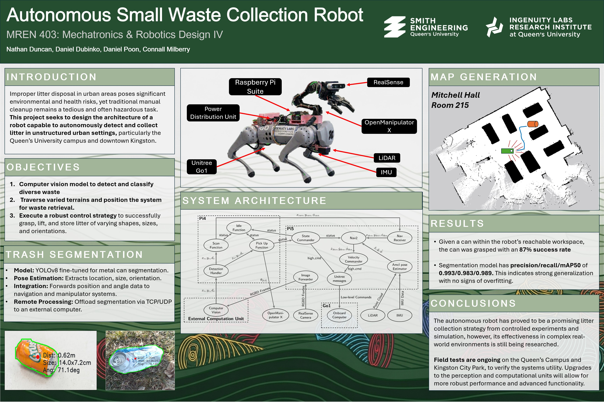
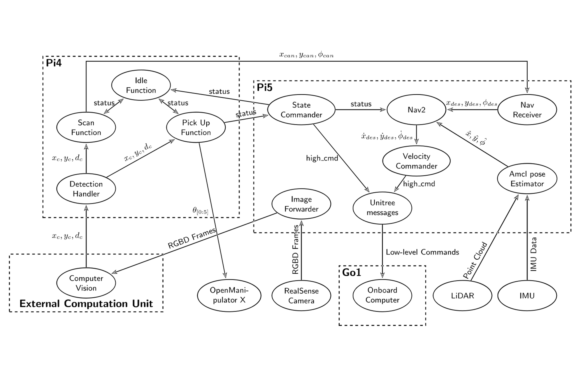

# Autonomous Litter-Collecting Robot (Capstone Project)
Unitree Go1 Litter Collecting Autononomus Robot

An autonomous, vision-guided litter-collection system built on the **Unitree Go1** quadruped robotics platform. This project integrates simultaneous localization and mapping (SLAM), advanced sensor fusion, object detection, and mobile autonomy to identify, navigate toward, and collect surface litter in real-time.

---

## Project Demonstration

Click the link below to watch the system in action, showcasing quadruped locomotion, real-time SLAM mapping, object detection, and autonomous navigation:

  

---

## System Architecture & Flow

Below is the high-level control and data flow of the autonomous system, illustrating how sensor data is fused to drive the perception, planning, and actuation loops.

## My Package is `autonomous_litter_bot_package`

Package `ros2_mpu6050` and `sllidar_ros2` and `rf2o_laser` are not mine. 

I am updating the code to function with my system and with ROS2 Jazzy.

Please go support them at their individual repos :)  

https://github.com/Slamtec/sllidar_ros2.git 
https://github.com/kimsniper/ros2_mpu6050.git 
https://github.com/MAPIRlab/rf2o_laser_odometry.git 

